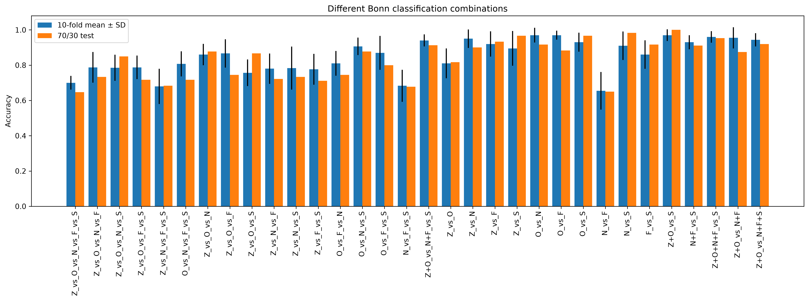
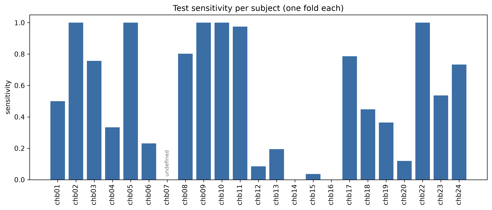

# ATCNet on two epilepsy EEG datasets: first results

*September 2026 · status: first complete run; the comparison with the other models is still to come*

## In short

We trained ATCNet, a published EEG model, to recognise seizures in brain-wave recordings from two
public epilepsy datasets. We changed the model only as much as the data required, and used the same shared
training settings that the other models in the study will use, so the results can be compared fairly later.

- **Bonn dataset:** when non-seizure recordings are grouped together and compared with seizure
  recordings, it is right 93–97% of the time. Telling finer groups apart is harder: 70% correct when all five
  recording groups are separated at once.
- **CHB-MIT dataset:** tested on patients it had never seen, it is right about 75% of the time. It
  rarely raises a false alarm (95% of non-seizure segments correctly left alone), but it misses about half
  of the seizures.

## What we did

ATCNet was first designed for brain–computer interfaces, systems that turn brain signals into commands.
We used the same version of it that the other models in this study are built around. The only changes:

1. **More input channels.** CHB-MIT recordings have 8 EEG channels; Bonn recordings have 1. The model now
   reads any number of channels. With a single channel it behaves exactly like the shared version (we
   checked this number for number).
2. **Units.** CHB-MIT signals were stored in volts, Bonn signals in microvolts. We converted CHB-MIT to
   microvolts, because at volt scale the numbers are too small for the model's built-in scaling steps to work.

Everything else is the same shared setup used for every model in the comparison: 100 training rounds, the
same learning settings, the same way of splitting the data and the same scoring.

## The data and how we tested

**Bonn** (University of Bonn): 500 single-channel recordings of 23.6 seconds each, in five groups of 100:
Z (healthy, eyes open), O (healthy, eyes closed), N and F (people with epilepsy, between seizures, recorded
from two different brain areas) and S (during a seizure). We tested 32 ways of grouping them, from all five
groups at once down to simple two-group questions. For each question, the recordings were split into 10
parts. Each part was used once for testing while the model learned from the rest, with a small portion held
back as a *check set* to choose which training round to keep. We report the average and the spread (±). A
separate 70/30 split of the same recordings gives a second check.

**CHB-MIT** (Boston Children's Hospital, from the public PhysioNet archive): 2,053 ten-second segments from
23 young patients, mostly children, 8 channels each, about half during seizures. Patients are identified by
the dataset's codes (chb01 to chb24). The model was always tested on a patient it had never seen: it learned
from 21 patients, used one more patient as the check set, and was then tested on the remaining patient. This
was repeated for every patient. Recordings made from the same patient at different times (chb01 and chb21;
chb17a and chb17b) were always kept together.

**How to read the numbers**

- **Accuracy:** share of recordings or segments labelled correctly.
- **Seizures caught (sensitivity):** share of seizure segments the model flagged.
- **Correct "no seizure" (specificity):** share of non-seizure segments left alone, i.e. no false alarm.
- **Cut-off:** the model gives every segment a seizure score between 0 and 1; a score of 0.5 or more
  counts as "seizure".
- **AUC:** how well the scores rank seizure above non-seizure, whatever cut-off is used. 1.0 is perfect;
  0.5 is no better than a coin toss.

## Results: Bonn

| Question asked | 10-part test (average ± spread) | 70/30 test | AUC |
|---|---|---|---|
| All five groups (Z / O / N / F / S) | 70.0 ± 3.9% | 64.7% | 0.94 |
| Any non-seizure vs seizure (Z+O+N+F vs S) | 96.0 ± 3.3% | 95.3% | 0.99 |
| Healthy vs seizure (Z+O vs S) | 97.0 ± 3.3% | 100.0% | 1.00 |
| Patients between seizures vs seizure (N+F vs S) | 93.0 ± 4.0% | 91.1% | 0.99 |
| Healthy vs between seizures vs seizure (Z+O vs N+F vs S) | 94.0 ± 3.4% | 91.3% | 0.99 |
| Hardest pair: the two between-seizure groups (N vs F) | 65.5 ± 10.7% | 65.0% | 0.76 |

AUC is the 10-part average; for questions with more than two groups it is the average of each group
scored against all the others.

Across all 32 questions: two-group questions scored 65.5–97.0%, three-group 68.3–94.0%, four-group
68.0–80.8%.

*Accuracy for all 32 questions. Blue: 10-part average (black line = spread). Orange: 70/30 test.*

## Results: CHB-MIT (each patient tested unseen)

| Measure | Average over patients (± spread) | All test segments together |
|---|---|---|
| Accuracy | 75.4 ± 17.5% | 72.9% |
| Seizures caught | 54.1 ± 37.7%\* | 49.9% |
| Correct "no seizure" | 94.6 ± 9.8% | 95.3% |
| AUC | 0.86 ± 0.20\* | 0.77 |

\* Average over 22 patients: chb07 has no seizure segments in the prepared data, so these cannot be measured
for it. Its false-alarm rate was 3.2% (1 of 31 segments flagged).

Results vary a lot from patient to patient. Accuracy was highest for chb02 (100%), chb10 (98.8%), chb22
(94.7%) and chb11 (90.6%). The model caught few or no seizures for chb14, chb16, chb15, chb12 and chb20.

*Share of each patient's seizure segments that the model caught (1.0 = all). chb07 is marked "undefined"
because it has no seizure segments.*

## What stands out

1. **Seizure vs no seizure is the easy part on Bonn.** Separating the two between-seizure groups (N vs F)
   is hard, as those recordings look alike.
2. **The CHB-MIT test, which uses unseen patients, is harder.** There the model is cautious: few false
   alarms, many missed seizures.
3. **The cut-off is often part of the problem.** For several patients the model scores seizures higher than
   non-seizures (high AUC) but misses them at the fixed 0.5 cut-off. chb16 is the clearest example: perfect
   ranking, yet no seizure caught, though it has only 8 segments. The scores also do not line up between
   patients (AUC 0.86 per patient but 0.77 when all segments are pooled), so one cut-off does not suit
   everyone, and choosing one per patient would need that patient's seizure labels.
4. **The kept version of the model is often an early one.** Training keeps whichever round scored best on
   the check set. On CHB-MIT, that best score came in the first four rounds for 11 of 23 patients and was
   never beaten afterwards (only 2 of these were perfect scores). The same rule applies to every model in the
   comparison, so it may affect them too; we will agree on how to handle it before the final comparison.

## Limits of these results

- Bonn has only 10 people (5 healthy, 5 with epilepsy), and its splits separate recordings, not people, so
  its scores are likely optimistic. Its healthy groups were recorded on the scalp and its patient groups from
  inside the skull, so part of the easy healthy-vs-seizure result may come from the recording method itself.
- The CHB-MIT data was balanced to about half seizure segments. In real recordings seizures are rare, so
  these numbers do not translate directly into real-world alarm rates.
- Each split was trained once. Repeating with different random starting points would show how stable the
  results are.

## Next steps

1. Run the other models (EEGNet, TCFormer) on exactly the same splits; an automatic check confirms that
   the splits match.
2. Agree on the two points above (the early-kept model and the fixed cut-off) for all models together.
3. Compare the models side by side on both datasets.

*Compute used: one rented GPU (NVIDIA RTX 4000 Ada), about 4 hours in total, running many training jobs
side by side. Full per-question and per-patient tables, charts and trained models are kept with the study
outputs, outside this repository.*
